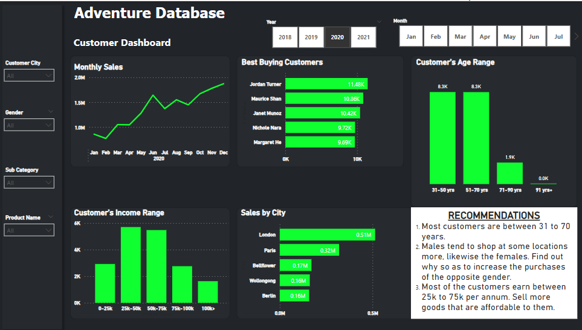

# AdventureWorks Sample Database Project

- This project uses the AdventureWorks sample database to showcase various SQL queries, data analysis, and reports.
- The AdventureWorks sample database is a fictional company database that represents a bicycle manufacturer's operations.
- The data contained in the database is from 2005 to January 2021.
- This project focuses on the existing customers and the similarities amongst them to see where the most money is being made and from what demographic of people and how to get more profit moving forward.

## Table of Contents

- [Installation](#installation)
- [The Database Schema](#database-schema)
- [Business Questions](#business-questions)
- [Data Analysis](#data-analysis)
- [The Dashboard](#dashboard)

## Installation

You need to setup Microsoft SQL Server. [Use these instructions](https://learn.microsoft.com/en-us/sql/samples/adventureworks-install-configure?view=sql-server-ver15&tabs=ssms)

## The Database Schema

There are 30 tables in this database and they can be divided into these groups:
- Dimension Table
- Fact Table  
 
I used 7 tables which are
- **dbo.DimCustomer**: Stores customer data
- **dbo.DimDate**: Stores data concerning dates
- **dbo.DimProduct**: Data on the product like Name, Stock level, Colour, Days to manufacture.
- **dbo.DimProductCategory**: Product category key and names in different languages
- **dbo.DimProductSubCategory**: Product subcategory key and names in different languages
- **dbo.FactInternetSales**: Data like date sold, unit price, customer key etc

## Business Questions

All these questions are for the years 2018 - 2021  
- What demographic makes up the bulk of the customers? In age, gender and income.
- What cities should the business focus on to increase sales?
- Who are the highest spending customers?
- Are there trends in the sales overtime?

## Data Analysis
- [Data Wrangling](#data-wrangling)
- [Key Insights](#key-insights)
- [Recommendations](#recommendations)

## The Dashboard

